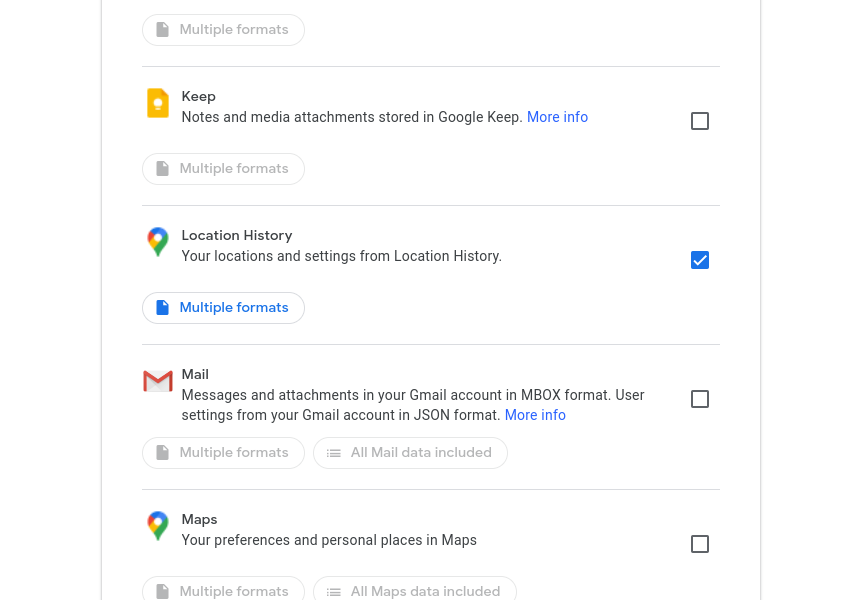

# Downloading the Data

To download your Location History data go to the [Google Takeout] page while logged in with your Google account.

There, create a new export containing the *Location History* data
(note: make sure all other data sources are not selected).

{ style="max-width: 800px;" }

In most cases a one-off download is enough, so, in the next screen choose *Export Once*,
and leave the other options at their default value
(the resulting file will almost certainly not exceed 2 GB).

{ style="max-width: 800px;" }

After a few minutes your data should be ready to download.
You will also receive an email informing you about this and providing a link.

{ style="max-width: 800px;" }

[Google Takeout]: https://takeout.google.com/settings/takeout
