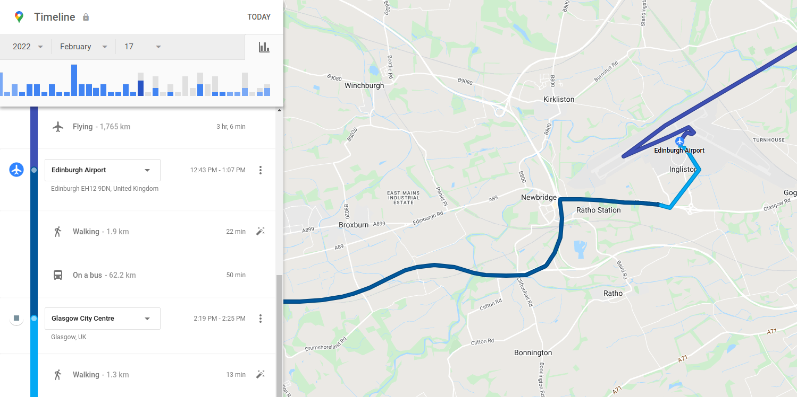

Consists of more high-level and processed data compared to the raw location data.

Found inside the `Semantic Location History` folder.

Contains *activity segments* and *place visits*.

Equivalent to the information shown in the *Timeline* on the website version.

!!! note "To Do"

    This page is incomplete.