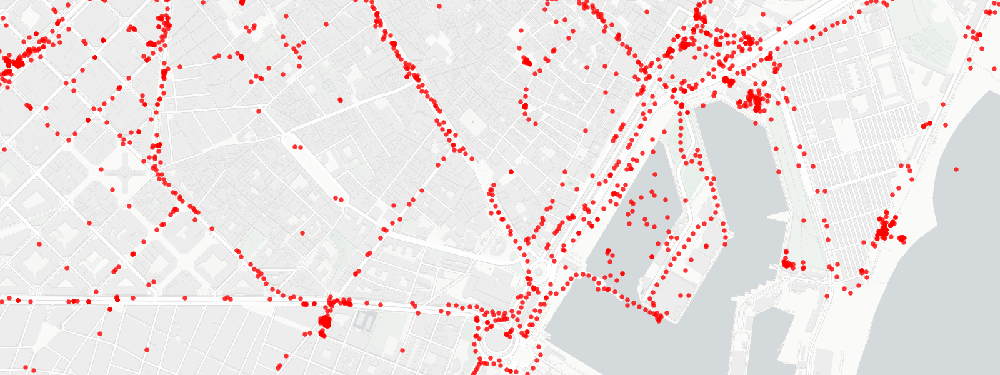

# Location History Format

Unofficial and collaborative format definition and documentation for Google Location History files.

!!! info ""

    This project is not affiliated, endorsed by, or in any way officially connected with Google.
    Official support for Google products can be found at <https://support.google.com/>.

Google (through its [Takeout service][Google Takeout]) allows users to easily and conveniently download their location history data.
Unfortunately Google has not provided proper official documentation for these files, so it can be sometimes difficult to navigate the structure of the files and understand the meaning of its fields.

This project attempts to fill that gap and do the job that Google should have done.
With this, the goals of this project are two-fold:

- **Provide a standarized format definition/specification describing the format and structure of the files.**
These format definitions are given in the form of [JSON schemas], which can be used, for example, for automatic validation of JSON files and to aid in the development of parsers.
You can find these files here: **TODO:** github link to folder.

- **Provide accessible and developer-friendly documentation for these formats.** how to interpret and what to expect from these files and its contents.
This is the very same website you are reading now (except if you are on Github readme xD)

An effort is being made to keep this information accurate, but due to its nature, the information provided by this project might be inaccurate and/or out of date.
Google has repeatedly made modifications to the format throughout the years without prior warning.
Contributions are very welcomed, if you notice errors, out-of-date information, or missing information, you can help to improve it, see [Contributing].

[Google Takeout]: https://takeout.google.com/settings/takeout
[JSON schemas]: https://json-schema.org
[Contributing]: contributing.md
